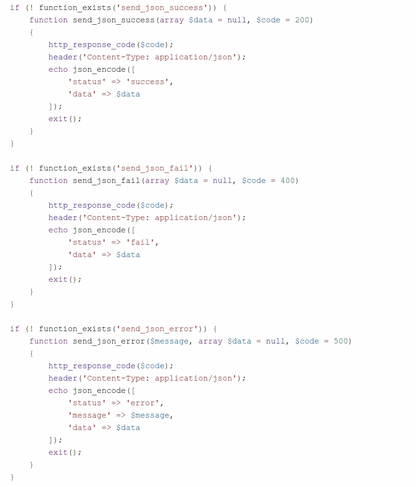
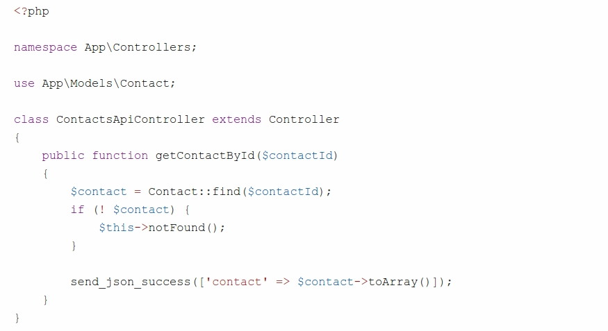
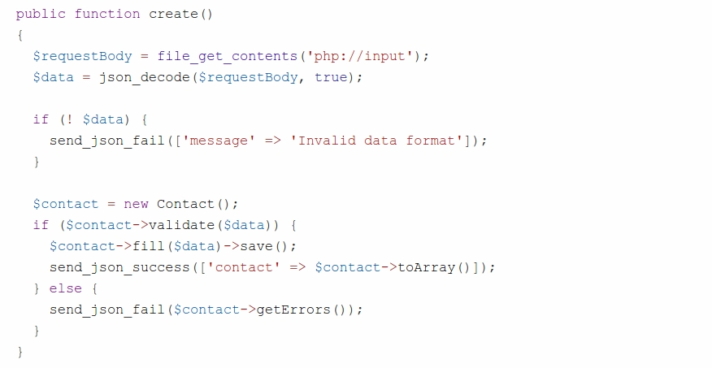

# **My Phonebook**

Xây dựng API cho ứng dụng web **My Phonebook** cho phép:

- Lấy thông tin một contact thông qua id, lấy danh sách contact, tìm kiếm contact, thêm/cập nhật/xóa contact
- Chứng thực người dùng API bằng giao thức HMAC

----

#### <u>Cài đặt, cấu hình ứng dụng</u>:

1. Tạo CSDL *phonebook* và import script *phonebook.sql* đã cho CSDL này

2. Sao chép thư mục *phonebook* đã cho vào một vị trí nào đó trên máy, giả sử tại thư mục *C:/xampp/apps*

3. Cấu hình host ảo cho thư mục *C:/xampp/apps/phonebook/public*

   1. Hiệu chỉnh tập tin *C:/xampp/apache/conf/httpd.conf*:

   ```
   ...
   Listen 80
   Listen 8080
   ...
   ```

   2. Hiệu chỉnh tập tin *C:/xampp/apache/conf/extra/httpd-vhosts.conf*:

   ```
   <VirtualHost *:8080>	
       DocumentRoot "C:/xampp/apps/phonebook/public" 
       ServerName localhost 
       # Set access permission 
       <Directory "C:/xampp/apps/phonebook/public"> 
           AllowOverride None
           Require all granted
           
           RewriteEngine On
   		RewriteCond %{REQUEST_FILENAME} !-f
   		RewriteCond %{REQUEST_FILENAME} !-d
   		RewriteRule ^.*$ index.php [L]
       </Directory>
   </VirtualHost>
   ```

   3. Restart lại server Apache

4. Vào thư mục gốc của dự án (thư mục *phonebook*), mở tập tin *db.php* để thay đổi các thông số kết nối đến CSDL

5. Mở Command Prompt và thực thi lệnh ```composer update``` để tải về các thư viện phụ thuộc

6. Kiểm tra chức năng đăng ký (http://localhost:8080/register), đăng nhập (http://localhost:8080/login) hoạt động

 #### <u>Định dạng câu trả lời của REST API</u>:####

Định dạng trả lời từ phía server theo đặc tả [**JSend**][https://labs.omniti.com/labs/jsend]:

* Lời gọi API thành công (**2xx**):

```json
{
    "status" : "success",
    "data" : {
        "posts" : [
           { "id" : 1, "title" : "A blog post", "body" : "Some useful content" },
           { "id" : 2, "title" : "Another blog post", "body" : "More content" },
        ]
     }
}
```

* Lời gọi API thất bại (**4xx**):

```json
{
    "status" : "fail",
    "data" : { "title" : "A title is required" }
}
```

* Lời gọi API bị lỗi trong quá trình xử lý (**5xx**):

```json
{
    "status" : "error",
    "message" : "Unable to communicate with database"
}
```

Mở tập tin *helpers.php* và thêm các hàm sau:

 

#### <u>Lấy thông tin một contact thông qua id</u>:

1. Mở tập tin *public/index.php*, định nghĩa một route mới như sau:

```php
Router::get('/api/v1/contacts/(:num)', 					
            		'\App\Controllers\ContactsApiController@getContactById');
```

2. Trong thư mục *app/Controllers/*, tạo tập tin *ContactsApiController.php*:

  

3. Thêm một vài contact vào CSDL, kiểm tra route vừa tạo (http://localhost:8080/api/v1/contacts/<contact-id>)

#### <u>Thêm một contact</u>:

1. Mở tập tin *public/index.php*, định nghĩa một route mới như sau:

```php
Router::post('/api/v1/contacts', '\App\Controllers\ContactsApiController@create');
```

2. Thêm hàm **create** trong tập tin *app/Controllers/ContactsApiController.php*:


 

3. Cài đặt một ứng dụng REST client (ví dụ **Insomnia** trên Google Chrome) để kiểm tra route vừa tạo:

```http
POST http://localhost:8080/api/v1/contacts

Content-Type: application/json
Accept: application/json

{
	"name":"Dinh Thanh Nam",
	"phone":"0985589635",
	"notes":"Engineer at TMA Solutions",
	"user_id":<user-id>
}
```

#### <u>Cập nhật một contact</u>:

Sinh viên tự cài đặt

#### <u>Xóa một contact</u>:

Sinh viên tự cài đặt
