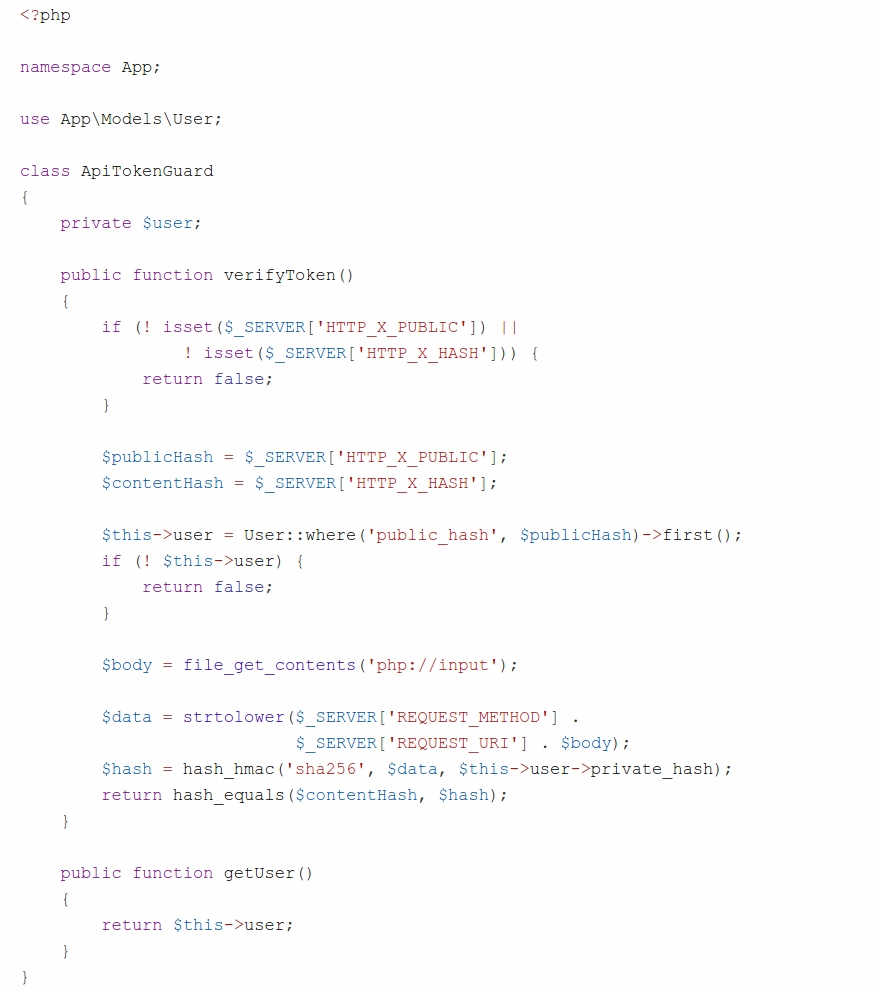

# **My Phonebook**

Xây dựng API cho ứng dụng web **My Phonebook** cho phép:

- Lấy thông tin một contact thông qua id, lấy danh sách contact, thêm/cập nhật/xóa contact
- Chứng thực người dùng API bằng giao thức HMAC

----

#### <u>Chứng thực người dùng bằng giao thức HMAC</u>:

1. Thêm 2 cột *public_hash* và *private_hash* (varchar, 32 ký tự) vào bảng dữ liệu users
2. Thay đổi hàm **createUser** định nghĩa trong tập tin *app/Controller/Auth/RegisterController.php*:


```php
protected function createUser($data)
{
  return User::create([
    'name' => $data['name'],
    'email' => $data['email'],
    'password' => password_hash($data['password'], PASSWORD_DEFAULT),
    'public_hash' => hash('sha256', openssl_random_pseudo_bytes(32)),
    'private_hash' => hash('sha256', openssl_random_pseudo_bytes(32))
  ]);    
}
```

3. Thay đổi tập tin *app/Models/User.php*:

```php
<?php

namespace App\Models;

use Illuminate\Database\Eloquent\Model;

class User extends Model
{
    protected $table = 'users';
    protected $fillable = ['name', 'email', 'password', 
                           		'public_hash', 'private_hash'];
	...    
}
```

4. Xóa dữ liệu trong CSDL, đăng ký người dùng mới và thêm một vài contact cho người dùng này
5. Trong thư mục *app*, tạo tập tin *ApiTokenGuard.php*:

 

6. Hiệu chỉnh tập tin *app/Controllers/ContactsApiController.php*:

```php
<?php

namespace App\Controllers;

use App\ApiTokenGuard;
use App\Models\Contact;

class ContactsApiController extends Controller
{
  	// Thông tin người dùng được chứng thực
    protected $user;

    public function __construct()
    {
        $apiGuard = new ApiTokenGuard();
        if (! $apiGuard->verifyToken()) {
            send_json_fail(['message' => 'Unauthenticated'], 401);
        }

        $this->user = $apiGuard->getUser();
        parent::__construct();
    }
  	...
}
```

7. Kiểm tra chức năng chứng thực vừa tạo. Chú ý ***tính toán*** content hash và gửi public hash + content hash cho server lần lượt thông qua 2 header: x-public và x-hash.

#### <u>Lấy danh sách contacts</u>:

Sinh viên tự cài đặt

#### <u>Tìm kiếm contact</u>:

URL có dạng như: http://localhost:8080/api/v1/contacts?name=Bao

Sinh viên tự cài đặt